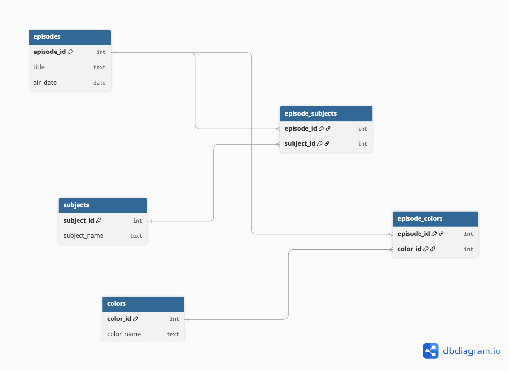

# The Joy of Painting API

An API that allows filtering of *The Joy of Painting* episodes by month of original broadcast, subject matter, and color palette. This project demonstrates database design, ETL (Extract, Transform, Load) data processing, and API development using PostgreSQL and Node.js.

---

## Project Overview

This project was developed for a local public broadcasting station to help viewers explore and filter Bob Ross painting episodes based on their interests.

- **Database**: PostgreSQL, designed to handle episodes, subjects, and colors with relational tables and many-to-many relationships.
- **ETL Process**: Scripts to parse and clean raw CSV data from various sources, transforming it to fit the database schema.
- **API**: An Express.js RESTful API that allows querying episodes by month, subjects painted, and colors used. Supports multiple filters and logical combinations.

---

## UML Database Design

The database schema is visualized in the UML diagram below, showing the main entities and their relationships:

---

## Features

- List all episodes, subjects, and colors
- Filter episodes by:
  - Month of original broadcast
  - Subject matter (e.g., Mountain, Tree, River)
  - Color palette (e.g., Bright Red, Deep Blue)
- Combine multiple filters using AND/OR logic
- Clean, structured JSON API responses